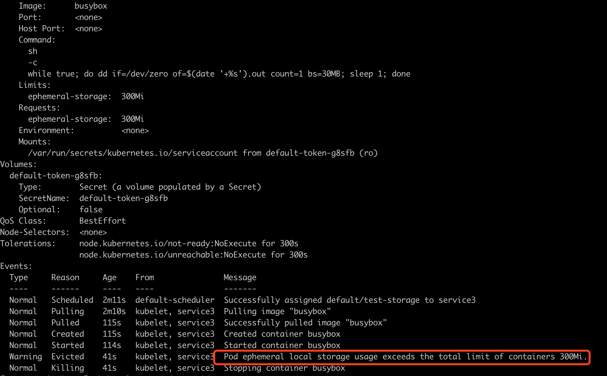

## 临时存储简介

`Node节点`通常还可以具有本地的临时性存储，由本地挂载的`可写入设备`或者 `RAM `来提供支持。 `临时（Ephemeral）` 意味着对所存储的数据不提供长期可用性的保证。

Pods 通常可以使用临时性本地存储来实现缓冲区、保存日志等功能。 kubelet 可以为使用本地临时存储的 Pods 提供这种存储空间，允许后者使用 `emptyDir` 类型的卷将其挂载到容器中。

kubelet 也使用此类存储来保存`节点层面的容器日志`， `容器镜像文件`、`以及运行中容器的可写入层`。

## 临时存储有那些

- 本地临时存储（local ephemeral storage）
- emptyDir

`本地临时存储（local ephemeral storage）`：Kubernetes在1.8的版本中引入了一种类似于CPU，内存的新的资源模式：ephemeral-storage，并且在1.10版本kubelet中默认打开这个特性。ephemeral-storage是为管理和调度Kubernetes中运行的应用短暂存储。

`emptyDir`：emptyDir 类型Volume在Pod分配到Node上时被创建，Kubernetes会在Node节点上自动分配一个目录，因此无需指定宿主机Node上对应的目录文件。 这个目录初始内容为空，当Pod从Node上移除时，emptyDir中的数据会被永久删除。

> 注释：容器的 `crashing` 事件并不会导致 `emptyDir` 中的数据被删除。

## 临时存储默认存储在哪个位置?

在每个 Kubernetes `Node节点` 上，kubelet 默认根目录是 `/var/lib/kubelet` 和 日志目录 `/var/log` 保存在节点的系统分区上，这个分区同时也会被Pod的 `EmptyDir` 类型的 `volume`、`容器日志`、`镜像层`、`容器的可写层所占用`。`ephemeral-storage` 便是对系统分区进行管理。

## 临时存储需要限制吗？

答案是 `需要限制`，从上文了解到，临时存储默认根目录是在 `/var/lib/kubelet` 中，`/var` 一般情况都是在系统根分区中，并且根分区磁盘一般不会很大（阿里云ECS系统盘默认为 40G），这就必须限制，为系统预留足够的磁盘空间来支持正常运行。上文也说到，临时存储也可以使用 RAM，那就更应该限制，内存是一种非常有限的资源。

## Node节点设置临时存储使用大小

Node节点上的 `kubelet` 组件启动时，kubelet会统计当前节点默认 `/var/lib/kubelet` 所在的分区可分配的磁盘资源，或者你可以覆盖节点上kubelet的配置来自定义可分配的资源。再创建Pod时会根据存储需求调度到满足存储的节点，再Pod使用超过限制的存储时会对其做`驱逐`处理来保证不会耗尽节点上的磁盘空间。

> 注意：如果运行时指定了别的独立的分区，比如修改了docker的镜像层和容器可写层的存储位置(默认是/var/lib/docker)所在的分区，将不再将其计入 `ephemeral-storage` 的消耗。

kubelet 如下配置，限制Node节点上临时存储能使用多大磁盘空间

```yaml
# Node 资源保留
  nodefs.available: 10% # 给 /var/lib/kubelet 所在分区保留 10% 磁盘空间
  nodefs.inodesFree: 5% # 给 /var/lib/kubelet 所在分区保留 5% inodes
```

## 临时存储限制使用举例

### 限制磁盘本地临时存储

```yaml
apiVersion: v1
kind: Pod
metadata:
  name: test-storage
  labels:
    app: test-storage
spec:
  containers:
  - name: busybox
    image:  busybox
    command: ["sh", "-c", "while true; do dd if=/dev/zero of=$(date '+%s').out count=1 bs=30MB; sleep 1; done"] # 使用dd命令持续往容器写数据
    resources:
      limits:
        ephemeral-storage: 300Mi #定义存储的限制为300Mi
      requests:
        ephemeral-storage: 300Mi
```

容器使用磁盘超过 300Mi，被 kubelet 驱逐。具体请见下图



### 限制内存临时存储

`emptyDir` 也是一种临时存储，因此也需要限制使用。

在Pod级别检查临时存储使用量时，也会将 `emptyDir` 的使用量计算在内，因此如果对 emptyDir 使用过量后，也会导致该Pod被 kubelet `Evict`。

另外，emptyDir本身也可以设置容量上限。指定 emptyDir 使用内存作为存储介质，这样用户可以获得极好的读写性能，但是由于内存比较珍贵，只提供了 `128Mi` 的空间，当用户在 `/cache-data` 目录下使用超过64Mi后，该Pod会被 kubelet 驱逐。

```yaml
        volumeMounts:
        - mountPath: /cache-data
          name: cache-data-volume
      volumes:
      - emptyDir:
          medium: Memory
          sizeLimit: 128Mi
        name: cache-data-volume
```

## 参考链接

- https://kubernetes.io/zh/docs/concepts/configuration/manage-resources-containers/
- https://developer.aliyun.com/article/594066
- https://ieevee.com/tech/2019/05/23/ephemeral-storage.html