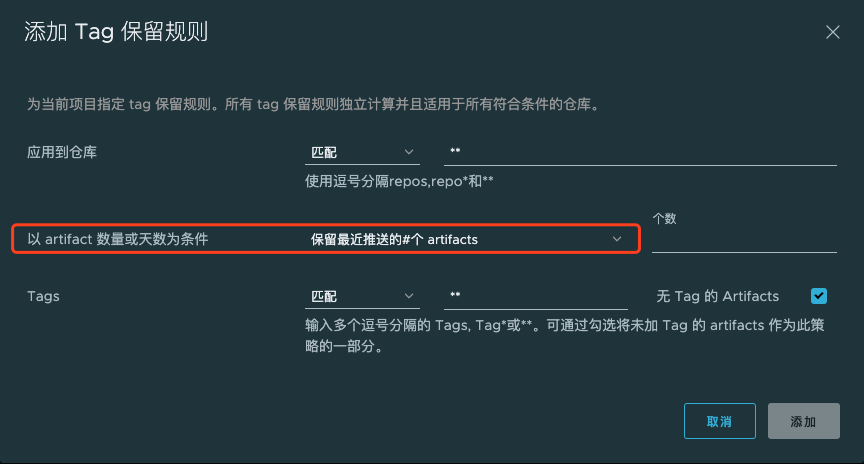

### Harbor 镜像回收流程

Harbor 镜像回收分两部分：

- 1、删除镜像 TAG
- 2、执行垃圾清理

早期 Harbor 1.0 版本时，`删除镜像TAG`可以通过UI界面手动一个个选取删除，也可以调用官方提供的`SDK`删除（很早以前官方不维护了）。后来官方在 `1.9` 版本提供`TAG保留策略`，解决以前镜像Tag回收麻烦的问题。

`TAG保留策略`有那些策略，如下图：




### Harbor Python SDK

作者写了一个 `Python SDK` 方法，锦上添花吧！

`代码项目地址`：https://github.com/yangpeng14/harbor_sdk_v2.0

> 注意：Harbor v2.0+ 和 Harbor v1 版本 API调用方式发生很大的改变。安全方面：修复`跨域攻击问题`，API登陆Harbor方法也发现变化。

```python
#!/usr/bin/env python3
# -*- coding=utf8 -*-

import logging
import requests

logging.basicConfig(level=logging.INFO)


class HarborClient(object):
    def __init__(self, host, user, password, protocol="http"):
        self.host = host
        self.user = user
        self.password = password
        self.protocol = protocol

        # 第一次get请求，获取 cookie 信息
        self.cookies, self.headers = self.get_cookie()

        # 获取登陆成功 session
        self.session_id = self.login()

        # 把登陆成功的 sid值 替换 get_cookie 方法中 cookie sid值，用于 delete 操作
        self.cookies_new = self.cookies
        self.cookies_new.update({'sid': self.session_id})

    # def __del__(self):
    #     self.logout()

    def get_cookie(self):
        response = requests.get("{0}://{1}/c/login".format(self.protocol, self.host))
        csrf_cookie = response.cookies.get_dict()
        headers = {'X-Harbor-CSRF-Token': csrf_cookie['__csrf']}
        return csrf_cookie, headers

    def login(self):
        login_data = requests.post('%s://%s/c/login' %
                                   (self.protocol, self.host),
                                   data={'principal': self.user,
                                         'password': self.password}, cookies=self.cookies, headers=self.headers)

        if login_data.status_code == 200:
            session_id = login_data.cookies.get('sid')

            logging.debug("Successfully login, session id: {}".format(
                session_id))
            return session_id
        else:
            logging.error("Fail to login, please try again")
            return None

    def logout(self):
        requests.get('%s://%s/c/logout' % (self.protocol, self.host),
                     cookies={'sid': self.session_id})
        logging.debug("Successfully logout")

    # GET /projects
    def get_projects(self, project_name=None, is_public=None):
        # TODO: support parameter
        result = []
        page = 1
        page_size = 15

        while True:
            path = '%s://%s/api/v2.0/projects?page=%s&page_size=%s' % (self.protocol, self.host, page, page_size)
            response = requests.get(path,
                                    cookies={'sid': self.session_id})
            if response.status_code == 200:
                logging.debug("Successfully get projects result: {}".format(
                    result))
                if isinstance(response.json(), list):
                    result.extend(response.json())
                    page += 1
                else:
                    break
            else:
                logging.error("Fail to get projects result")
                result = None
                break
        return result

    # GET /projects/{project_name}/repositories
    def get_repositories(self, project_name, query_string=None):
        # TODO: support parameter
        result = []
        page = 1
        page_size = 15

        while True:
            path = '%s://%s/api/v2.0/projects/%s/repositories?page=%s&page_size=%s' % (
                self.protocol, self.host, project_name, page, page_size)
            response = requests.get(path,
                                    cookies={'sid': self.session_id})
            if response.status_code == 200:
                logging.debug(
                    "Successfully get repositories with name: {}, result: {}".format(
                        project_name, result))
                if len(response.json()):
                    result.extend(response.json())
                    page += 1
                else:
                    break
            else:
                logging.error("Fail to get repositories result with name: {}".format(
                    project_name))
                result = None
                break
        return result

    # GET /projects/{project_name}/repositories/{repository_name}/artifacts
    # GET /projects/{project_name}/repositories/{repository_name}/artifacts?with_tag=true&with_scan_overview=true&with_label=true&page_size=15&page=1
    def get_repository_artifacts(self, project_name, repository_name):
        result = []
        page = 1
        page_size = 15

        while True:
            path = '%s://%s/api/v2.0/projects/%s/repositories/%s/artifacts?with_tag=true&with_scan_overview=true&with_label=true&page_size=%s&page=%s' % (
                self.protocol, self.host, project_name, repository_name, page_size, page)
            response = requests.get(path,
                                    cookies={'sid': self.session_id}, timeout=60)
            if response.status_code == 200:
                logging.debug(
                    "Successfully get repositories artifacts with name: {}, {}, result: {}".format(
                        project_name, repository_name, result))
                if len(response.json()):
                    result.extend(response.json())
                    page += 1
                else:
                    break
            else:
                logging.error("Fail to get repositories artifacts result with name: {}, {}".format(
                    project_name, repository_name))
                result = None
                break
        return result

    # DELETE /projects/{project_name}/repositories/{repository_name}
    def delete_repository(self, project_name, repository_name, tag=None):
        # TODO: support to check tag
        # TODO: return 200 but the repo is not deleted, need more test
        result = False
        path = '%s://%s/api/v2.0/projects/%s/repositories/%s' % (
            self.protocol, self.host, project_name, repository_name)
        response = requests.delete(path,
                                   cookies=self.cookies_new, headers=self.headers)
        if response.status_code == 200:
            result = True
            print("Delete {} successful!".format(repository_name))
            logging.debug("Successfully delete repository: {}".format(
                repository_name))
        else:
            logging.error("Fail to delete repository: {}".format(repository_name))
        return result

    # Get /projects/{project_name}/repositories/{repository_name}/artifacts/{reference}/tags
    def get_repository_tags(self, project_name, repository_name, reference_hash):
        result = None
        path = '%s://%s/api/v2.0/projects/%s/repositories/%s/artifacts/%s/tags' % (
            self.protocol, self.host, project_name, repository_name, reference_hash)
        response = requests.get(path,
                                cookies={'sid': self.session_id}, timeout=60)
        if response.status_code == 200:
            result = response.json()
            logging.debug(
                "Successfully get tag with repository name: {}, result: {}".format(
                    repository_name, result))
        else:
            logging.error("Fail to get tags with repository name: {}".format(
                repository_name))
        return result

    # Del /projects/{project_name}/repositories/{repository_name}/artifacts/{reference}/tags/{tag_name}
    def del_repository_tag(self, project_name, repository_name, reference_hash, tag):
        result = False
        path = '%s://%s/api/v2.0/projects/%s/repositories/%s/artifacts/%s/tags/%s' % (
            self.protocol, self.host, project_name, repository_name, reference_hash, tag)
        response = requests.delete(path, cookies=self.cookies_new, headers=self.headers)
        if response.status_code == 200:
            result = True
            print("Delete {} {} {} {} successful!".format(project_name, repository_name, reference_hash, tag))
            logging.debug(
                "Successfully delete repository project_name: {}, repository_name: {}, reference_hash: {}, tag: {}".format(
                    project_name, repository_name, reference_hash, tag))
        else:
            logging.error("Fail to delete repository project_name: {}, repository_name: {}, reference_hash: {}, tag: {}".format(
                project_name, repository_name, reference_hash, tag))
        return result

    # Del /projects/{project_name}/repositories/{repository_name}/artifacts/{reference}
    def del_artifacts_hash(self, project_name, repository_name, reference_hash):
        result = False
        path = '%s://%s/api/v2.0/projects/%s/repositories/%s/artifacts/%s' % (
            self.protocol, self.host, project_name, repository_name, reference_hash)
        response = requests.delete(path, cookies=self.cookies_new, headers=self.headers)
        if response.status_code == 200:
            result = True
            print("Delete artifacts hash {} {} {} successful!".format(project_name, repository_name, reference_hash))
            logging.debug(
                "Successfully delete repository project_name: {}, repository_name: {}, artifacts hash: {}".format(
                    project_name, repository_name, reference_hash))
        else:
            logging.error("Fail to delete repository project_name: {}, repository_name: {}, artifacts hash: {}".format(
                project_name, repository_name, reference_hash))
        return result
```

## 使用举例

列出 Harbor Projects

```python
import harborclient_modify_v2_0

class GetHarborApi(object):
    def __init__(self, host, user, password, protocol="http"):
        self.host = host
        self.user = user
        self.password = password
        self.protocol = protocol
        self.client = harborclient_modify_v2_0.HarborClient(self.host, self.user, self.password, self.protocol)

    def main(self):
        print(self.client.get_projects())

if __name__ == '__main__':
    host = "harbor.example.com"
    user = "admin"
    password = "******"
    protocol = "https"
    cline_get = GetHarborApi(host, user, password, protocol)
    cline_get.main()
```